  

## 📌 About Me
- I'm a teenage dev looking to create amazing projects! ⭐️

## 🧠 My Focus Areas
- Python Development
- Web Development
- AI Learning

## 📊 GitHub Stats & Trophies

  

  

## 🛠️ Languages & Tools

> ## Programming Languages

 

> ## Frontend

  

> ## Tools

  

<picture>
  <source media="(prefers-color-scheme: dark)" srcset="https://raw.githubusercontent.com/abozanona/abozanona/output/pacman-contribution-graph-dark.svg">
  <source media="(prefers-color-scheme: light)" srcset="https://raw.githubusercontent.com/abozanona/abozanona/output/pacman-contribution-graph.svg">
  
</picture>

  

